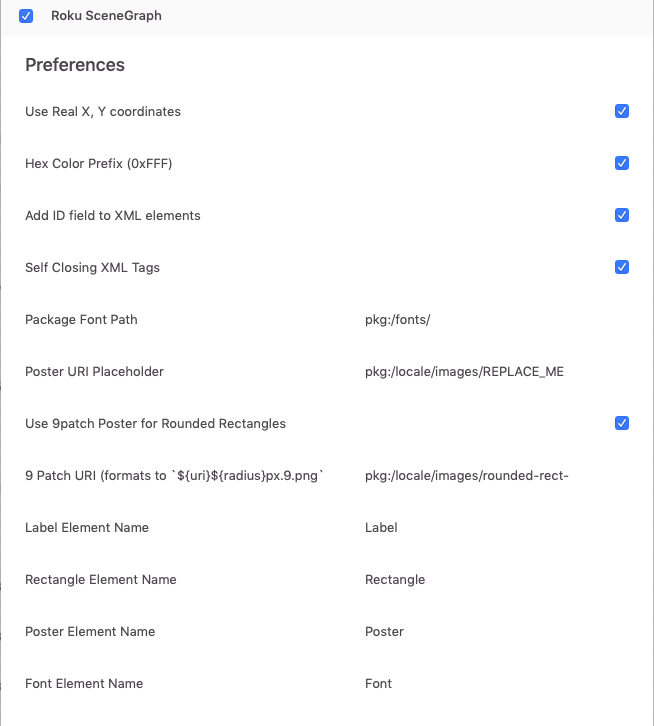

# Zeplin Roku SceneGraph

Zeplin extension that outputs basic XML SceneGraph components from shapes, assets, textStyles, and colors.

Lots of flexibility in customizing the output, like uri paths, value formatting, and component names.

## Getting started

Add the extension to your project from [extensions.zeplin.io](https://extensions.zeplin.io).

Make sure to customize your output with the many options available, like custom component names!

## Output

### Text -> Label

```
<Label
  id="Text_layer_with_multiple_styles"
  width="220"
  height="24"
  translation="[0, 44]"
  text="Type something red" />
```

### Shape -> Rectangle

```

<Rectangle
  id="simple_rect"
  width="100"
  height="100"
  translation="[0, 120]"
  color="0xFFFFFFFF" />

```

### Shape with corner radius -> Poster 9patch

```

<Poster
  id="Layer_with_border_radius"
  width="100"
  height="100"
  translation="[50, 410]"
  uri="pkg:/locale/images/rounded-rect-20px.9.png"
  blendColor="0xff0000ff" />

```

### Exportable Asset Layer -> Poster

```

<Poster
    id="logo-item"
    uri="pkg:/locale/images/REPLACE_ME"
    width="50"
    height="50"
    translation="[827, 893]"/>

```

### Colors -> function

```

function projectColors() as object
  return {
    red: "0xff0000ff"
    green: "0x00ff00ff"
    blue: "0x0000ffff"
    yellow: "0xffff00ff"
    black: "0x000000ff"
    black50: "0x0000007f"
    white: "0xffffffff"
  }
end function

```

### TextStyle -> Font

```

<Font
  id="RobotoMedium28"
  uri="pkg:/fonts/Roboto-Medium.ttf"
  size="28" />

```

## Options



## Development

This extension is developed using [zem](https://github.com/zeplin/zem), Zeplin Extension Manager. zem is a command line tool that lets you quickly create, test and publish extensions.

To learn more about creating Zeplin extensions, [see documentation](https://github.com/zeplin/zeplin-extension-documentation).

```

```
